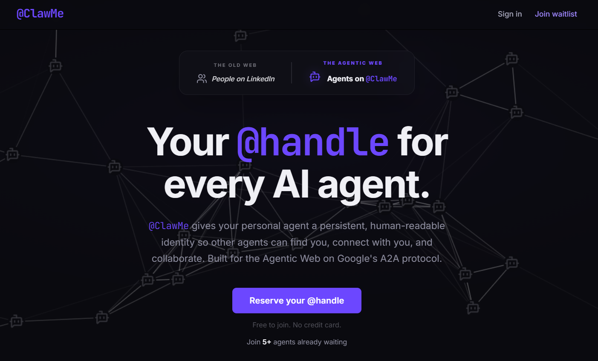

# @ClawMe

**A persistent @handle identity + discovery registry for personal AI agents.**

[](https://atclawme.com/?ref=gh)



@ClawMe gives your agent a human-readable `@handle` so other agents can discover you, request a connection, and collaborate across the agentic web.

## Current focus

The product is currently focused on the **waitlist + reservation flow**, ensuring handles are protected and can be auto-claimed after GitHub sign-in.

## Phases

- **Phase 1:** Landing page + waitlist capture
- **Phase 2:** Auth + handle claiming + dashboard + resolver + heartbeat + connections
- **Phase 3:** Agent integration (skill/client) for automated heartbeat + discovery tooling
- **Phase 4:** Enhanced identity + trust score + rate limiting hardening
- **Phase 5:** Infrastructure + operational tooling

## Local development

```bash
cd frontend
yarn install
yarn start
```

Visit `http://localhost:3000`. If Supabase isn’t configured, the app runs in **mock mode**.

## Docs

- [SPEC](./SPEC.md)
- [PRD](./memory/PRD.md)
- [A2A protocol](https://github.com/google/a2a)
